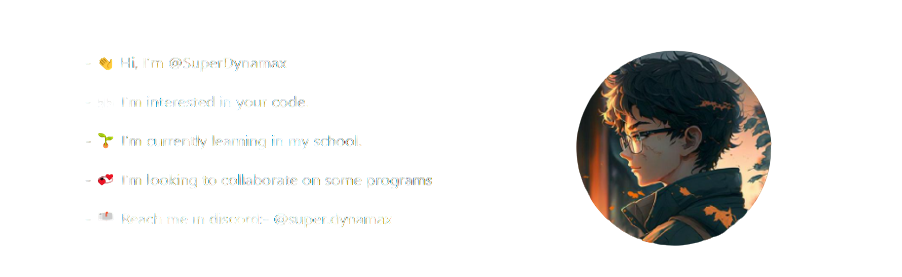

  <h1> 𝐇𝐞𝐥𝐥𝐨 𝐭𝐡𝐞𝐫𝐞, 𝐟𝐞𝐥𝐥𝐨𝐰 <𝚍𝚎𝚟𝚎𝚕𝚘𝚙𝚎𝚛𝚜>! </h1>
  
  <!--📏LINE-->
  

  <!--
 
    
 - 👋 Hi, I’m @SuperDynamax 

    
 - 👀 I’m interested in your code. 

    
 - 🌱 I’m currently learning in my school. 

    
 - 💞️ I’m looking to collaborate on some programs 

    
 - 📫 Reach me in discord:- @super.dynamax 

  

  

    
  
-->
  

  
  
  
  
  
  
  
  

<!--📏LINE-->

  <h2> Playing this on Spotify 🎧 </h2>

  

  <!---->

  <!--📏LINE-->
  

  
  

  <!--
 <strong> My Stats [⭐]</strong> 
-->

   
     
    

    

   
     
    

    

   
       

    

        

    

  <!--📏LINE-->
  

  <h2> My Report [📝] </h2>

   

    

    

        

    

        

    

  <!--📏LINE-->
  

  
  <h4>

    @@ @ @ @ @ @ @ @ @ @ @ @ @ @ @ @ @ @ @ @ @ @ @ @ @ @ @ @@
    @@       o o                                           @@
    @@       | |                                           @@
    @@      _L_L_                                          @@
    @@   ❮\/__-__\/❯ Programming isn't about what you know @@
    @@   ❮(|~o.o~|)❯  It's about what you can figure out   @@
    @@   ❮/ \`-'/ \❯                                       @@
    @@     _/`U'\_                                         @@
    @@    ( .   . )     .----------------------------.     @@
    @@   / /     \ \    | while( ! (succed=try() ) ) |     @@
    @@   \ |  ,  | /    '----------------------------'     @@
    @@    \|=====|/                                        @@
    @@     |_.^._|                                         @@
    @@     | |"| |                                         @@
    @@     ( ) ( )   Testing leads to failure              @@
    @@     |_| |_|   and failure leads to understanding    @@
    @@ _.-' _j L_ '-._                                     @@
    @@(___.'     '.___)                                    @@
    @@ @ @ @ @ @ @ @ @ @ @ @ @ @ @ @ @ @ @ @ @ @ @ @ @ @ @ @@

  </h4>

  

<!--📏LINE-->

